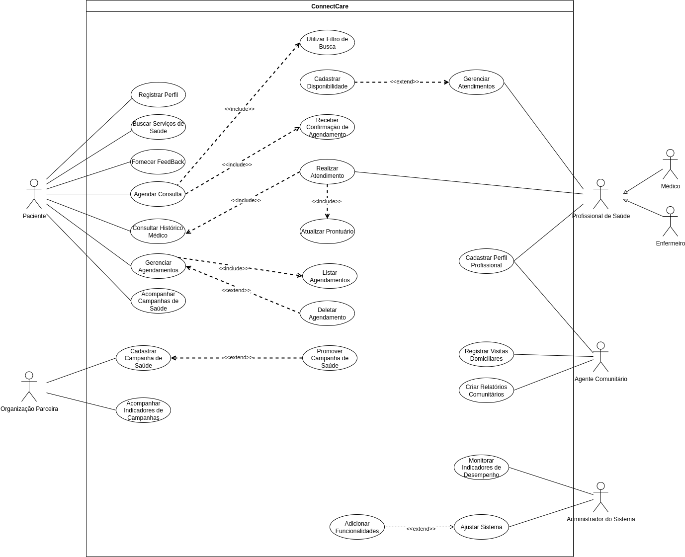

# ConnectCare

O ConnectCare é uma plataforma digital desenvolvida para melhorar o acesso à saúde em comunidades vulneráveis, como a Vila Esperança. Sua proposta é conectar pacientes, profissionais de saúde e organizações parceiras por meio de tecnologias acessíveis, mesmo em regiões com infraestrutura limitada.

## Especificação de Caso de Uso: Agendar Consulta

### 1. Breve Descrição

Este caso de uso permite ao ator Paciente realizar o agendamento de um serviço de saúde através da plataforma ConnectCare. O processo envolve a busca e filtragem por tipo de serviço, especialidade ou localização, a seleção de um horário disponível e a confirmação do agendamento.

### 2. Pré-Condições

*   **PC-1:** O Paciente deve estar registrado e autenticado no sistema "ConnectCare".
*   **PC-2:** Deve haver profissionais de saúde e/ou agentes comunitários com perfis cadastrados no sistema.

### 3. Fluxo Básico de Eventos (FB) - Realizar Novo Agendamento

Este fluxo descreve o caminho ideal para um novo agendamento.

1. O Paciente acessa o sistema ConnectCare e seleciona a opção 'Agendar Consulta'.
2. O sistema exibe as opções de busca por serviços de saúde (especialidade, localização, etc.).
3. O Paciente utiliza o filtro de busca para encontrar um serviço de saúde desejado.
4. O sistema exibe a disponibilidade de horários para o serviço/profissional selecionado.
5. O Paciente seleciona um horário disponível.
6. O sistema solicita a confirmação do agendamento ao Paciente.
7. O Paciente confirma o agendamento.
8. O sistema registra o agendamento e envia uma confirmação ao Paciente e ao Profissional de Saúde.
9. O caso de uso termina.

### 4. Fluxos Alternativos (FA)

#### FA1: Paciente não encontra disponibilidade

Se o Paciente não encontrar um horário disponível que atenda às suas necessidades, ele pode optar por:

    a. Alterar os filtros de busca (data, profissional, etc.) e tentar novamente.
    b. Salvar a busca para ser notificado sobre novas disponibilidades.
    c. Sair do processo de agendamento.

### 5. Fluxos de Exceção (FE)

#### FE1: Erro ao processar agendamento

Se ocorrer um erro no sistema durante o processamento do agendamento (ex: falha no banco de dados), o sistema deve:

    a. Informar ao Paciente sobre o erro.
    b. Não registrar o agendamento.
    c. Sugerir que o Paciente tente novamente mais tarde.

### 6. Pós-Condições

*   **PósC-Sucesso:** A consulta deve estar registrada no sistema, e tanto o Paciente quanto o Profissional de Saúde devem ter recebido a confirmação.
*   **PósC-Cancelamento:** O agendamento selecionado é removido do sistema e o horário correspondente é liberado na agenda do profissional.

### 7. Pontos de Extensão

*   **PE-1:** O ponto de extensão <<include>> Receber Confirmação de Agendamento é acionado após o sistema registrar o agendamento com sucesso.

### 8. Regras de Negócio

*   **RN-1:** Um agendamento só pode ser realizado se houver disponibilidade de horário e profissional/unidade de saúde compatível com os critérios de busca do Paciente.
*   **RN-2:** Agendamentos devem ser confirmados por notificação ao Paciente e ao Profissional de Saúde.

### 9. Requisitos Especiais

*   **RSE-1 (Desempenho):** O aplicativo deve ser projetado para funcionar de forma eficiente em dispositivos simples e com conexões de internet limitadas, comuns em comunidades remotas.
*   **RSE-2 (Usabilidade):** O sistema deve fornecer uma interface intuitiva e de fácil compreensão. Deve incluir recursos como mapas simplificados que podem ser acessados offline para ajudar na localização.
*   **RSE-3 (Segurança):** A plataforma deve garantir a conformidade com as regulamentações de proteção de dados para manter as informações dos Pacientes seguras e confidenciais.

### 10. Informações Adicionais

*   O sistema pode enviar notificações de lembretes antes da consulta, com informações relevantes como a necessidade de levar documentos e o uso de máscara.

## Especificação de Caso de Uso: Consultar Histórico Médico

### 1. Breve Descrição

Este caso de uso descreve como um Paciente pode acessar e visualizar seu histórico médico completo dentro do sistema ConnectCare. Isso inclui informações sobre consultas anteriores, diagnósticos, tratamentos e medicações, proporcionando ao paciente uma visão abrangente de sua saúde.

### 2. Pré-Condições

*   **PC-1:** O Paciente deve estar autenticado no sistema ConnectCare.

### 3. Fluxo Básico de Eventos (FB) - Visualizar Histórico

Este fluxo descreve o caminho ideal para visualizar o histórico médico.

1.  O caso de uso inicia quando o Paciente acessa o sistema ConnectCare e seleciona a opção "Consultar Histórico Médico".
2.  O sistema solicita a autenticação do Paciente (se ainda não estiver logado).
3.  O sistema recupera o histórico médico do Paciente do banco de dados.
4.  O sistema exibe o histórico médico do Paciente, organizado por data ou tipo de evento.
5.  O Paciente pode navegar e visualizar os detalhes de cada registro do histórico.
6.  O caso de uso termina com sucesso.

### 4. Fluxos Alternativos (FA)

#### FA1: Histórico vazio

Este fluxo é iniciado no passo 4 do Fluxo Básico, se o Paciente não possuir histórico médico registrado.

No passo 4 do Fluxo Básico, se o Paciente não possuir histórico médico registrado no sistema, o sistema deve:

    a. Exibir uma mensagem informando que não há histórico disponível.
    b. Sugerir ao Paciente que agende uma consulta para iniciar seu histórico.

### 5. Fluxos de Exceção (FE)

#### FE1: Erro ao carregar histórico

Este fluxo pode ser iniciado a qualquer momento durante a execução do caso de uso, se houver um erro no sistema.

Se ocorrer um erro no sistema ao tentar carregar o histórico médico (ex: problema de conexão com o banco de dados), o sistema deve:

    a. Informar ao Paciente sobre o erro.
    b. Sugerir que o Paciente tente novamente mais tarde.

### 6. Pós-Condições

*   **PósC-Sucesso:** O Paciente terá visualizado seu histórico médico no sistema.

### 7. Pontos de Extensão

*   **PE-1: Visualizar Histórico do Paciente:** O ponto de extensão <<include>> Visualizar Histórico do Paciente é acionado quando o Profissional de Saúde acessa o histórico do paciente durante um atendimento.

### 8. Regras de Negócio

*   **RN-1:** O acesso ao histórico médico é restrito ao Paciente e a Profissionais de Saúde autorizados.
*   **RN-2:** O sistema deve apresentar o histórico de forma clara e organizada.

### 9. Requisitos Especiais

*   **RSE-1 (Privacidade):** O sistema deve garantir a privacidade e segurança dos dados do histórico médico do Paciente, seguindo as regulamentações de proteção de dados (e.g., LGPD).

### 10. Informações Adicionais

*   Nenhuma informação adicional.

## Especificação de Caso de Uso: Realizar Atendimento

### 1. Breve Descrição

Este caso de uso descreve o processo pelo qual um Profissional de Saúde realiza um atendimento a um Paciente utilizando o sistema ConnectCare. Durante o atendimento, o profissional pode acessar o histórico do paciente, registrar novas informações e atualizar o prontuário.

### 2. Pré-Condições

*   **PC-1:** O Profissional de Saúde deve estar autenticado no sistema ConnectCare e ter acesso à funcionalidade de gerenciamento de atendimentos.
*   **PC-2:** Deve haver um agendamento prévio para o atendimento ou o paciente deve ser atendido por demanda.

### 3. Fluxo Básico de Eventos (FB) - Registrar Atendimento

Este fluxo descreve o caminho ideal para registrar um atendimento.

1.  O caso de uso inicia quando o Profissional de Saúde acessa o sistema ConnectCare e seleciona a opção "Gerenciar Atendimentos".
2.  O sistema exibe a lista de agendamentos do profissional.
3.  O Profissional de Saúde seleciona o agendamento do Paciente a ser atendido.
4.  O sistema exibe as informações do Paciente e permite o acesso ao seu histórico médico.
5.  O Profissional de Saúde realiza o atendimento, registrando informações relevantes no prontuário do Paciente.
6.  O sistema atualiza o prontuário do Paciente com as novas informações.
7.  O caso de uso termina com sucesso.

### 4. Fluxos Alternativos (FA)

#### FA1: Paciente não comparece

Este fluxo é iniciado no passo 5 do Fluxo Básico, se o Paciente não comparecer ao atendimento.

No passo 5 do Fluxo Básico, se o Paciente não comparecer ao atendimento agendado, o Profissional de Saúde pode:

    a. Marcar o agendamento como "Não Compareceu".
    b. Enviar uma notificação ao Paciente para reagendamento.

### 5. Fluxos de Exceção (FE)

#### FE1: Erro ao registrar atendimento

Este fluxo pode ser iniciado a qualquer momento durante a execução do caso de uso, se houver um erro no sistema.

Se ocorrer um erro no sistema ao tentar registrar as informações do atendimento ou atualizar o prontuário (ex: falha de conexão), o sistema deve:

    a. Informar ao Profissional de Saúde sobre o erro.
    b. Salvar as informações temporariamente e tentar sincronizar novamente.
    c. Sugerir que o Profissional de Saúde tente registrar as informações novamente.

### 6. Pós-Condições

*   **PósC-Sucesso:** As informações do atendimento são registradas no sistema e o prontuário do Paciente é atualizado.

### 7. Pontos de Extensão

*   **PE-1: Atualizar Prontuário:** O ponto de extensão <<include>> Atualizar Prontuário é acionado quando o Profissional de Saúde registra novas informações no prontuário do Paciente durante o atendimento.

### 8. Regras de Negócio

*   **RN-1:** Todas as informações relevantes do atendimento devem ser registradas no prontuário do paciente.
*   **RN-2:** O sistema deve garantir a integridade dos dados registrados.

### 9. Requisitos Especiais

*   **RSE-1 (Acesso Rápido):** O sistema deve permitir que o Profissional de Saúde acesse rapidamente o histórico médico completo do Paciente durante o atendimento para auxiliar no diagnóstico e tratamento.

### 10. Informações Adicionais

*   Nenhuma informação adicional.

## Especificação de Caso de Uso: Gerenciar Agendamentos

### 1. Breve Descrição

Este caso de uso descreve o processo pelo qual um Paciente pode visualizar e gerenciar seus agendamentos no sistema ConnectCare. Isso inclui a capacidade de listar todos os agendamentos existentes e a opção de deletar agendamentos.

### 2. Pré-Condições

*   **PC-1:** O Paciente deve estar autenticado no sistema ConnectCare.

### 3. Fluxo Básico de Eventos (FB) - Visualizar e Gerenciar Agendamentos

Este fluxo descreve o caminho ideal para visualizar e gerenciar agendamentos.

1.  O caso de uso inicia quando o Paciente acessa o sistema ConnectCare e seleciona a opção "Gerenciar Agendamentos".
2.  O sistema exibe uma lista de agendamentos associados ao Paciente.
3.  O Paciente pode visualizar os detalhes de cada agendamento (data, hora, serviço, profissional/paciente).
4.  O Paciente pode selecionar um agendamento e optar por deletá-lo.
5.  O sistema solicita confirmação para a exclusão do agendamento.
6.  O Paciente confirma a exclusão.
7.  O sistema remove o agendamento do banco de dados.
8.  O caso de uso termina com sucesso.

### 4. Fluxos Alternativos (FA)

#### FA1: Nenhum agendamento encontrado

Este fluxo é iniciado no passo 2 do Fluxo Básico, se não houver agendamentos para o Paciente.

No passo 2 do Fluxo Básico, se não houver agendamentos para o Paciente, o sistema deve:

    a. Exibir uma mensagem informando que não há agendamentos.
    b. Sugerir ao Paciente que agende uma nova consulta.

### 5. Fluxos de Exceção (FE)

#### FE1: Erro ao listar agendamentos

Este fluxo pode ser iniciado a qualquer momento durante a execução do caso de uso, se houver um erro no sistema.

Se ocorrer um erro no sistema ao tentar listar os agendamentos (ex: falha de conexão com o banco de dados), o sistema deve:

    a. Informar ao Paciente sobre o erro.
    b. Sugerir que o Paciente tente novamente mais tarde.

### 6. Pós-Condições

*   **PósC-Sucesso:** O Paciente terá visualizado seus agendamentos gerenciados e poderá excluir um agendamento se necessário.

### 7. Pontos de Extensão

*   **PE-1: Listar Agendamentos:** O ponto de extensão <<include>> Listar Agendamentos é acionado para exibir a lista de agendamentos.
*   **PE-2: Deletar Agendamento:** O ponto de extensão <<extend>> Deletar Agendamento é acionado quando o Paciente optar por remover um agendamento.

### 8. Regras de Negócio

*   **RN-1:** O Paciente pode deletar agendamentos.
*   **RN-2:** O sistema deve notificar as partes envolvidas sobre qualquer alteração no agendamento.

### 9. Requisitos Especiais

*   **RSE-1 (Filtros):** O sistema deve permitir que o Paciente filtre os agendamentos por data, status (confirmado, cancelado, realizado).

### 10. Informações Adicionais

*   Nenhuma informação adicional.

## Especificação de Caso de Uso: Registrar Visitas Domiciliares

### 1. Breve Descrição

Este caso de uso permite ao ator Agente Comunitário de Saúde registrar de forma padronizada as informações detalhadas das visitas domiciliares realizadas a pacientes ou famílias em sua área de atuação. O processo envolve a identificação do visitado, o registro da data, motivo, observações e resultados, garantindo um acompanhamento eficaz da saúde da comunidade.

### 2. Pré-Condições

*   **PC-1:** O Agente Comunitário de Saúde deve estar registrado e autenticado no sistema "ConnectCare".
*   **PC-2:** Deve haver pacientes previamente cadastrados no sistema.

### 3. Fluxo Básico de Eventos (FB) – Registro de Nova Visita

Este fluxo descreve o caminho ideal para registrar uma nova visita domiciliar.

1.  O caso de uso inicia quando o Agente Comunitário de Saúde seleciona a opção "Registrar Visita Domiciliar".
2.  O sistema exibe um formulário padronizado para o registro da visita.
3.  O Agente Comunitário de Saúde informa os dados da visita:
    *   Identificação do paciente (busca por nome, CPF, ou outro identificador).
    *   Data e hora da visita.
    *   Motivo principal da visita (seleção de lista pré-definida).
    *   Observações gerais e resultados da visita.
    *   Encaminhamentos realizados ou pendências identificadas.
4.  O Agente Comunitário de Saúde confirma o registro das informações.
5.  O sistema valida os dados e persiste o registro da visita no banco de dados.
6.  O sistema exibe uma mensagem de confirmação de que a visita foi registrada com sucesso.
7.  O caso de uso é encerrado com sucesso.

### 4. Fluxos Alternativos (FA)

#### FA1: Anexar Mídia à Visita

Este fluxo é iniciado no passo 4 do Fluxo Básico, quando o Agente Comunitário de Saúde opta por anexar mídias.

1.  No passo 4 do Fluxo Básico, o Agente Comunitário de Saúde pode optar por anexar mídias (fotos, áudios) relacionadas à visita.
2.  O sistema permite o upload de arquivos de mídia.
3.  O Agente Comunitário de Saúde seleciona e anexa os arquivos.
4.  O sistema associa os arquivos de mídia ao registro da visita.
5.  O fluxo retorna ao passo 5 do Fluxo Básico.

### 5. Fluxos de Exceção (FE)

#### FE1: Dados Obrigatórios Incompletos

Este fluxo é iniciado no passo 4 do Fluxo Básico, se o Agente Comunitário tentar confirmar o registro com campos obrigatórios não preenchidos ou inválidos.

1.  No passo 4 do Fluxo Básico, se o Agente Comunitário tentar confirmar o registro com campos obrigatórios não preenchidos ou inválidos, o sistema deve indicar os campos que precisam de correção.
2.  O fluxo retorna ao passo 4 do Fluxo Básico.

#### FE2: Falha no Registro da Visita

Este fluxo é iniciado no passo 5 do Fluxo Básico, se ocorrer uma falha técnica durante a tentativa de salvar o registro.

1.  No passo 5 do Fluxo Básico, se ocorrer uma falha técnica (ex: erro de conectividade, problema no servidor) durante a tentativa de salvar o registro, o sistema deve exibir uma mensagem de erro.
2.  O sistema sugere que o Agente Comunitário tente novamente mais tarde.
3.  O caso de uso é encerrado.

### 6. Pós-Condições

*   **PósC-Sucesso:** Uma nova visita domiciliar é registrada no sistema, associada ao Agente Comunitário e ao paciente.
*   **PósC-Falha:** O registro da visita não é persistente no sistema.

### 7. Pontos de Extensão

*   **PE-1: N/A:** Não há pontos de extensão.

### 8. Regras de Negócio

*   **RN-1:** Todas as visitas domiciliares devem ser registradas para acompanhamento e análise.
*   **RN-2:** O sistema deve garantir a consistência e a integridade dos dados registrados.

### 9. Requisitos Especiais

*   **RSE-1 (Offline):** O sistema deve permitir o registro de visitas domiciliares mesmo sem conexão com a internet, sincronizando os dados automaticamente quando a conexão for restabelecida.

### 10. Informações Adicionais

*   O sistema pode sugerir agendamento de próximas visitas com base nas necessidades identificadas.
*   Integrar a funcionalidade de geolocalização para registrar o local exato da visita, se permitido e relevante.

## Especificação de Caso de Uso: Criar Relatórios Comunitários

### 1. Breve Descrição

Este caso de uso descreve o processo pelo qual um Agente Comunitário gera relatórios sobre as atividades e dados coletados na comunidade. Esses relatórios podem incluir informações sobre visitas domiciliares, indicadores de saúde da população, entre outros, visando subsidiar a tomada de decisões e o planejamento de ações futuras.

### 2. Pré-Condições

*   **PC-1:** O Agente Comunitário deve estar autenticado no sistema ConnectCare e ter permissão para criar relatórios comunitários.

### 3. Fluxo Básico de Eventos (FB) - Gerar Relatório

Este fluxo descreve o caminho ideal para gerar um relatório comunitário.

1.  O caso de uso inicia quando o Agente Comunitário acessa o sistema ConnectCare e seleciona a opção "Criar Relatórios Comunitários".
2.  O sistema exibe as opções de tipos de relatórios e filtros disponíveis (período, área geográfica, tipo de dado, etc).
3.  O Agente Comunitário seleciona o tipo de relatório desejado e aplica os filtros necessários.
4.  O sistema processa os dados com base nos filtros selecionados.
5.  O sistema gera o relatório comunitário no formato escolhido (ex: PDF).
6.  O sistema exibe o relatório gerado ou oferece a opção de download.
7.  O caso de uso termina com sucesso.

### 4. Fluxos Alternativos (FA)

#### FA1: Relatório sem dados

Este fluxo é iniciado no passo 5 do Fluxo Básico, se não houver dados para o relatório.

No passo 5 do Fluxo Básico, se, após a aplicação dos filtros, não houver dados disponíveis para a geração do relatório, o sistema deve:

    a. Informar ao Agente Comunitário que não foram encontrados dados para os critérios selecionados.
    b. Sugerir a alteração dos filtros ou a verificação da entrada de dados.

### 5. Fluxos de Exceção (FE)

#### FE1: Erro ao gerar relatório

Este fluxo pode ser iniciado a qualquer momento durante a execução do caso de uso, se houver um erro no sistema.

Se ocorrer um erro no sistema durante o processo de geração do relatório (ex: falha no processamento de dados), o sistema deve:

    a. Informar ao Agente Comunitário sobre o erro.
    b. Registrar o erro para análise e correção.
    c. Sugerir que o Agente Comunitário tente gerar o relatório novamente mais tarde.

### 6. Pós-Condições

*   **PósC-Sucesso:** O relatório comunitário é gerado com sucesso e está disponível para visualização ou download.

### 7. Pontos de Extensão

*   **PE-1: N/A:** Não há pontos de extensão.

### 8. Regras de Negócio

*   **RN-1:** Os relatórios devem ser gerados com base em dados consistentes e atualizados.
*   **RN-2:** O sistema deve garantir a segurança e a privacidade dos dados apresentados nos relatórios.

### 9. Requisitos Especiais

*   **RSE-1 (Personalização):** O sistema deve permitir que o Agente Comunitário personalize os relatórios, escolhendo quais informações incluir e o formato de apresentação.

### 10. Informações Adicionais

*   Nenhuma informação adicional.