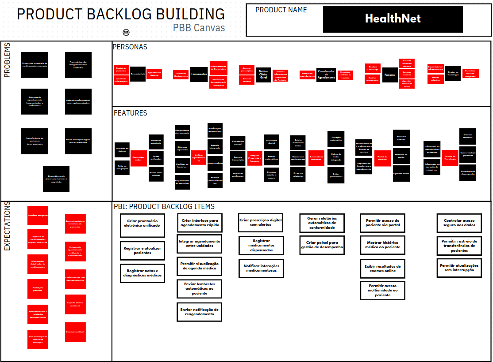

## 1.1 Product Backlog Building
O Product Backlog Building (PBB) é uma técnica colaborativa que combina Design Thinking com princípios ágeis para estruturar e priorizar requisitos com foco nas necessidades do cliente. Ele facilita a criação do backlog por meio de perguntas-chave sobre o que deve ser construído, para quem e com qual finalidade. O PBB Canvas, sua principal ferramenta visual, organiza informações como objetivos de negócio, personas e atividades dos usuários, permitindo que a equipe traduza essas informações em tarefas priorizadas. Essa abordagem promove alinhamento entre stakeholders, melhora a comunicação e torna o desenvolvimento mais eficiente e orientado ao valor.

## 1.2 Estudo de Caso - HealthNet

O Canvas de Product Backlog Building da empresa "HealthNet" foi realizada em equipe com o auxílio da plataforma Canva.

O Canvas PBB pode ser visualizado abaixo:

  <iframe loading="lazy" style="position: absolute; width: 100%; height: 100%; top: 0; left: 0; border: none; padding: 0;margin: 0;"
    src="https://www.canva.com/design/DAGqI3k-Naw/0td_UOMTVlHZC9-GoYHCyA/view?embed" allowfullscreen="allowfullscreen" allow="fullscreen">
  </iframe>

<a href="https:&#x2F;&#x2F;www.canva.com&#x2F;design&#x2F;DAGqI3k-Naw&#x2F;0td_UOMTVlHZC9-GoYHCyA&#x2F;view?utm_content=DAGqI3k-Naw&amp;utm_campaign=designshare&amp;utm_medium=embeds&amp;utm_source=link" target="_blank" rel="noopener">PBB - HealthNet</a>

## 1.3. Critérios de Aceitação das Histórias de Usuários - HealthNet

> **US01: Eu, como médico, quero acessar um prontuário eletrônico unificado, para que eu tenha uma visão completa do histórico clínico dos pacientes, independentemente da unidade onde foram atendidos.**
- O sistema deve exibir o histórico completo do paciente, incluindo registros de diferentes unidades.
- Se o paciente não possuir registros, o sistema deve exibir um prontuário vazio com uma mensagem de aviso.
- A busca por pacientes deve ser feita de forma unificada entre unidades.
- O acesso ao prontuário exige autenticação de um usuário médico.

> **US02: Eu, como coordenador de agendamento, quero uma interface rápida de agendamento, para que eu otimize a marcação de consultas e reduza o tempo de espera dos pacientes.**
- A interface deve permitir selecionar paciente, médico e horário disponíveis.
- Ao confirmar, a consulta deve ser registrada imediatamente na agenda do médico.
- Horários ocupados devem ser bloqueados para novo agendamento.
- O sistema deve exibir mensagem de erro ao tentar agendar em horário já ocupado.

> **US03: Eu, como médico, quero prescrever medicamentos digitalmente com alertas, para que eu seja avisado sobre interações perigosas e erros de dosagem.**
- O sistema deve emitir alertas ao detectar interação entre medicamentos.
- Alertas de interação devem ter níveis de criticidade (alta, média, baixa).
- Alertas de alergia registrada devem ser exibidos com destaque.
- A prescrição só deve ser confirmada após a ciência do médico sobre o alerta.

> **US04: Eu, como diretor de tecnologia, quero gerar relatórios automáticos de conformidade, para que eu cumpra as exigências regulatórias com precisão e menos esforço.**
- A funcionalidade deve estar disponível apenas para perfis de administrador.
- Os relatórios devem ser gerados em PDF contendo trilhas de auditoria.
- Usuários sem permissão devem receber a mensagem de acesso negado.
- O relatório deve ser gerado a partir de parâmetros configuráveis (ex: período).

> **US05: Eu, como paciente, quero acessar minhas informações de saúde via portal, para que eu acompanhe meu tratamento com mais autonomia.**
- O acesso deve ser feito com CPF e senha cadastrados.
- O sistema deve validar as credenciais e exibir mensagens claras de erro em caso de falha.
- Após login, o paciente deve ser redirecionado ao painel de informações.
- O sistema deve garantir segurança e privacidade dos dados acessados.

> **US06: Eu, como diretor de tecnologia, quero garantir controle seguro aos dados dos pacientes, para que a rede esteja em conformidade com a LGPD e evite vazamentos.**
- Perfis de acesso devem restringir funcionalidades conforme o cargo do usuário.
- Tentativas de acesso indevido devem ser registradas em log de segurança.
- O sistema deve forçar logout após 30 minutos de inatividade.
- Após logout, qualquer nova ação deve redirecionar à tela de login.

> **US07: Eu, como recepcionista, quero registrar e atualizar os dados dos pacientes com facilidade, para que o atendimento seja mais rápido e confiável.**
- O sistema deve permitir edição dos dados dos pacientes.
- Mudanças devem ser salvas apenas após validação de campos obrigatórios.
- Deve ser exibida mensagem de sucesso ao salvar corretamente.
- Campos obrigatórios em branco devem gerar mensagens de erro específicas.

> **US08: Eu, como paciente, quero agendar consultas em diferentes unidades da HealthNet, para que eu tenha mais flexibilidade e praticidade nos meus atendimentos.**
- O sistema deve permitir busca por especialidade e unidade.
- Se a especialidade não estiver disponível, o sistema deve sugerir outras unidades.
- Ao confirmar o agendamento, ele deve estar visível tanto para o paciente quanto para a unidade.
- O paciente pode consultar os agendamentos futuros em qualquer unidade.

> **US09: Eu, como farmacêutica, quero registrar automaticamente os medicamentos que entrego, para que eu controle melhor o estoque e o histórico do paciente.**
- O sistema deve registrar a entrega com base na prescrição digital.
- O status do medicamento deve mudar para 'Dispensado' após registro.
- O estoque deve ser automaticamente decrementado.
- Se não houver estoque, a entrega deve ser bloqueada e exibir erro.

> **US10: Eu, como diretor de tecnologia, quero um painel com indicadores de desempenho, para que eu acompanhe a eficiência do sistema e das unidades da rede.**
- O painel deve conter gráficos de desempenho por unidade.
- Métricas como tempo médio de espera e número de atendimentos devem estar visíveis.
- O usuário deve poder aplicar filtros por período (ex: últimos 7 dias).
- Os gráficos devem atualizar automaticamente ao aplicar filtros.

## 1.4 Cenários de BDD - HealthNet:

### Criar prontuário eletrônico unificado

**História de Usuário:**  
"Eu, como médico, quero acessar um prontuário eletrônico unificado, para que eu tenha uma visão completa do histórico clínico dos pacientes, independentemente da unidade onde foram atendidos."

**CENÁRIO 1: Acesso ao prontuário com histórico de múltiplas unidades**  
Dado que o médico Dr. Carlos está autenticado no sistema da HealthNet na "Unidade A".  
E que o paciente "José da Silva" possui um histórico de consultas na "Unidade A" e um registro de exame de imagem na "Unidade B".  
Quando o Dr. Carlos pesquisar pelo paciente "José da Silva" e acessar seu prontuário.  
Então o sistema deve exibir a lista de consultas realizadas na "Unidade A".  
E o sistema deve também exibir o registro do exame de imagem realizado na "Unidade B".

**CENÁRIO 2: Acesso ao prontuário de um paciente novo**  
Dado que o médico está autenticado no sistema..  
E que o paciente "Mariana Costa" é novo e não possui registros clínicos anteriores..  
Quando o médico acessar o prontuário de "Mariana Costa".  
Então o sistema deve exibir um prontuário vazio com uma mensagem indicando "Nenhum registro clínico encontrado para este paciente".

---

### Criar interface para agendamento rápido

**História de Usuário:**  
"Eu, como coordenador de agendamento, quero uma interface rápida de agendamento, para que eu otimize a marcação de consultas e reduza o tempo de espera dos pacientes."

**CENÁRIO 1: Agendamento rápido de uma nova consulta**  
Dado que o coordenador de agendamento está na "Interface de Agendamento Rápido".  
Quando ele selecionar o paciente "Ana Souza", o médico "Dr. Silva" e o horário disponível "10:30 de 24/06/2025".  
E clicar em "Confirmar Agendamento".  
Então a consulta deve ser criada imediatamente na agenda do "Dr. Silva".  
E o horário de "10:30 de 24/06/2025" deve aparecer como "ocupado".

**CENÁRIO 2: Tentativa de agendamento em horário já ocupado**  
Dado que o coordenador está na interface de agendamento.  
E que o horário das 11:00 do Dr. Silva já está ocupado.  
Quando ele tentar agendar um novo paciente para o Dr. Silva às 11:00.  
Então o sistema deve exibir uma mensagem de erro "Este horário não está mais disponível. Por favor, selecione outro." e não deve permitir o agendamento.

---

### Criar prescrição digital com alertas

**História de Usuário:**  
"Eu, como médico, quero prescrever medicamentos digitalmente com alertas, para que eu seja avisado sobre interações perigosas e erros de dosagem."

**CENÁRIO 1: Alerta de interação medicamentosa**  
Dado que o médico está prescrevendo para um paciente que já utiliza "Varfarina".  
Quando ele adicionar "Ibuprofeno" à nova prescrição.  
Então o sistema deve exibir um alerta crítico: "Risco de interação: Ibuprofeno pode aumentar o efeito anticoagulante da Varfarina".

**CENÁRIO 2: Alerta de alergia registrada**  
Dado que o paciente "Joana" tem alergia a "Penicilina" registrada em seu prontuário.  
Quando o médico tentar prescrever "Amoxicilina" (um derivado da penicilina) para Joana.  
Então o sistema deve exibir um alerta de alta prioridade: "ALERTA DE ALERGIA: Paciente possui alergia registrada a Penicilina".

---

### Gerar relatórios automáticos de conformidade

**História de Usuário:**  
"Eu, como diretor de tecnologia, quero gerar relatórios automáticos de conformidade, para que eu cumpra as exigências regulatórias com precisão e menos esforço."

**CENÁRIO 1: Geração de relatório de conformidade**  
Dado que o diretor de tecnologia está logado com perfil de administrador.  
Quando ele solicitar o "Relatório de Acesso a Dados Sensíveis" para o último trimestre.  
E clicar em "Gerar".  
Então o sistema deve gerar um PDF com as trilhas de auditoria e disponibilizá-lo para download.

**CENÁRIO 2: Tentativa de gerar relatório sem permissão**  
Dado que um usuário com perfil de "Coordenador de Agendamento" tenta acessar o módulo de relatórios de conformidade.  
Quando ele clicar no link para "Relatórios de Conformidade".  
Então o sistema deve redirecioná-lo ou exibir a mensagem "Acesso negado. Você não possui permissão para acessar este recurso".

---

### Permitir acesso do paciente via portal

**História de Usuário:**  
"Eu, como paciente, quero acessar minhas informações de saúde via portal, para que eu acompanhe meu tratamento com mais autonomia."

**CENÁRIO 1: Acesso bem-sucedido ao portal**  
Dado que a paciente "Laura Mendes" possui um cadastro ativo.  
Quando ela inserir seu CPF e senha corretamente e clicar em "Entrar".  
Então o sistema deve autenticá-la e redirecioná-la para a página inicial do portal.

**CENÁRIO 2: Tentativa de login com senha incorreta**  
Dado que a paciente "Laura Mendes" está na página de login.  
Quando ela inserir seu CPF corretamente, mas uma senha errada.  
E clicar em "Entrar".  
Então o sistema deve exibir a mensagem "CPF ou senha inválidos. Tente novamente." e não permitir o acesso.

---

### Controlar acesso seguro aos dados

**História de Usuário:**  
"Eu, como diretor de tecnologia, quero garantir controle seguro aos dados dos pacientes, para que a rede esteja em conformidade com a LGPD e evite vazamentos."

**CENÁRIO 1: Tentativa de acesso não autorizado**  
Dado que um usuário com perfil de "Recepcionista" está logado.  
Quando ele tentar acessar a área de "Configurações de Administrador".  
Então o sistema deve negar o acesso e exibir a mensagem "Acesso negado".  
E registrar a tentativa no log de segurança.

**CENÁRIO 2: Logout automático por inatividade**  
Dado que um médico está logado no sistema.  
Quando sua sessão permanecer inativa por mais de 30 minutos.  
Então o sistema deve desconectá-lo automaticamente.  
E ao tentar realizar uma nova ação, ele deve ser direcionado para a tela de login.

---

### Registrar e atualizar pacientes

**História de Usuário:**  
"Eu, como recepcionista, quero registrar e atualizar os dados dos pacientes com facilidade, para que o atendimento seja mais rápido e confiável."

**CENÁRIO 1: Atualização de endereço de um paciente**  
Dado que a recepcionista Ana está logada no sistema e na tela de edição do cadastro da paciente "Maria Oliveira".  
E que o endereço atual da paciente no sistema é "Rua Antiga, 123".  
Quando Ana altera o campo de endereço para "Rua Nova, 456" e clica em "Salvar".  
Então o sistema deve exibir uma mensagem de sucesso "Dados atualizados com sucesso".  
E ao reabrir o cadastro de "Maria Oliveira", o endereço exibido deve ser "Rua Nova, 456".

**CENÁRIO 2: Tentativa de cadastro com dados obrigatórios faltando**  
Dado que a recepcionista está na tela de cadastro de um novo paciente.  
Quando ela preencher o nome mas deixar o campo "CPF" (obrigatório) em branco.  
E clicar em "Salvar".  
Então o sistema não deve salvar o registro.  
E deve exibir uma mensagem de erro: "Por favor, preencha todos os campos obrigatórios" junto ao campo CPF.

---

### Integrar agendamento entre unidades

**História de Usuário:**  
"Eu, como paciente, quero agendar consultas em diferentes unidades da HealthNet, para que eu tenha mais flexibilidade e praticidade nos meus atendimentos."

**CENÁRIO 1: Paciente agenda consulta em unidade diferente**  
Dado que o paciente "Fernando Lima", da "Unidade Central", está logado no portal.  
Quando ele buscar por "Cardiologia", selecionar a "Unidade Sul" e escolher um horário disponível.  
E confirmar a marcação.  
Então o sistema deve confirmar o agendamento na "Unidade Sul".  
E o agendamento deve ser visível para o paciente e para a equipe da "Unidade Sul".

**CENÁRIO 2: Especialidade não disponível na unidade desejada**  
Dado que o paciente "Fernando Lima" acessa o portal.  
Quando ele buscar pela especialidade "Dermatologia" na "Unidade Sul".  
E a "Unidade Sul" não oferecer essa especialidade.  
Então o sistema deve informar que "A especialidade Dermatologia não está disponível na unidade selecionada" e sugerir outras unidades.

---

### Registrar medicamentos dispensados

**História de Usuário:**  
"Eu, como farmacêutica, quero registrar automaticamente os medicamentos que entrego, para que eu controle melhor o estoque e o histórico do paciente."

**CENÁRIO 1: Registro da dispensa de um medicamento**  
Dado que a farmacêutica acessou a prescrição do paciente "Paulo Costa".  
E a prescrição contém "Amoxicilina 500mg".  
Quando ela registrar a entrega do medicamento.  
Então o status do item deve mudar para "Dispensado".  
E o estoque de "Amoxicilina 500mg" deve ser decrementado.

**CENÁRIO 2: Tentativa de dispensar medicamento sem estoque**  
Dado que a farmacêutica acessa a prescrição de "Carlos Eduardo".  
E o sistema indica que o estoque do medicamento "Losartana 50mg" é zero.  
Quando ela tentar registrar a entrega deste medicamento.  
Então o sistema deve bloquear a ação e exibir a mensagem "Operação não permitida: Estoque insuficiente".

---

### Criar painel para gestão de desempenho

**História de Usuário:**  
"Eu, como diretor de tecnologia, quero um painel com indicadores de desempenho, para que eu acompanhe a eficiência do sistema e das unidades da rede."

**CENÁRIO 1: Visualização de indicadores de desempenho**  
Dado que o diretor de tecnologia acessou o "Painel de Gestão".  
Quando ele visualizar a seção de "Desempenho por Unidade".  
Então o painel deve exibir gráficos atualizados com métricas como "tempo médio de espera" e "número de atendimentos por dia".

**CENÁRIO 2: Filtrar dados do painel por período**  
Dado que o diretor está no painel de gestão.  
Quando ele selecionar o filtro de data para "Últimos 7 dias".  
Então todos os gráficos e métricas no painel devem ser atualizados para refletir apenas os dados do período selecionado.
