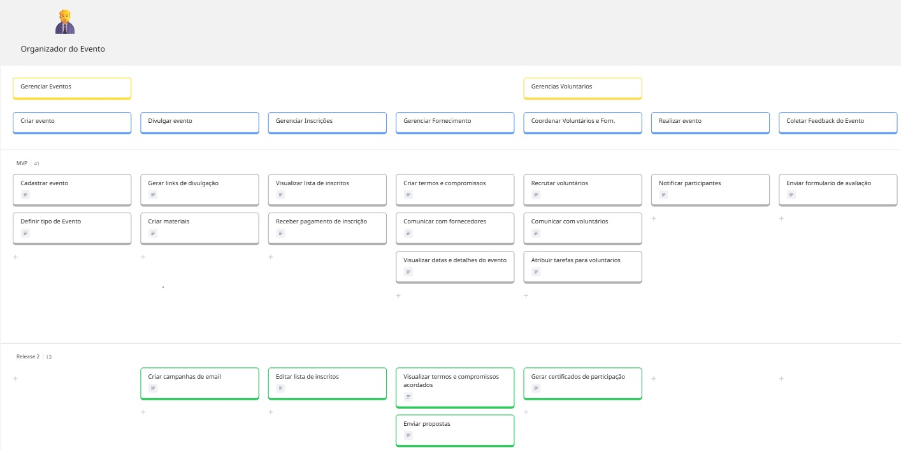
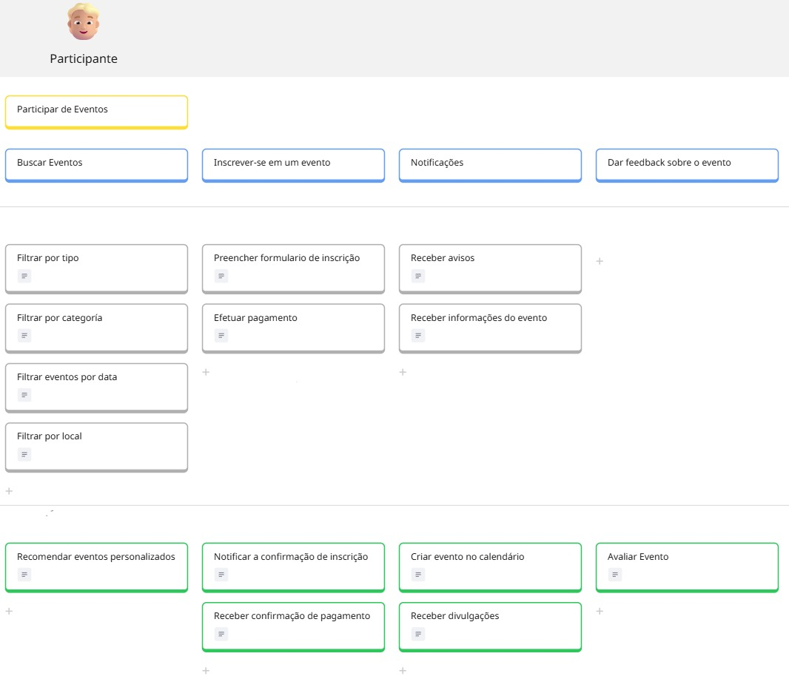
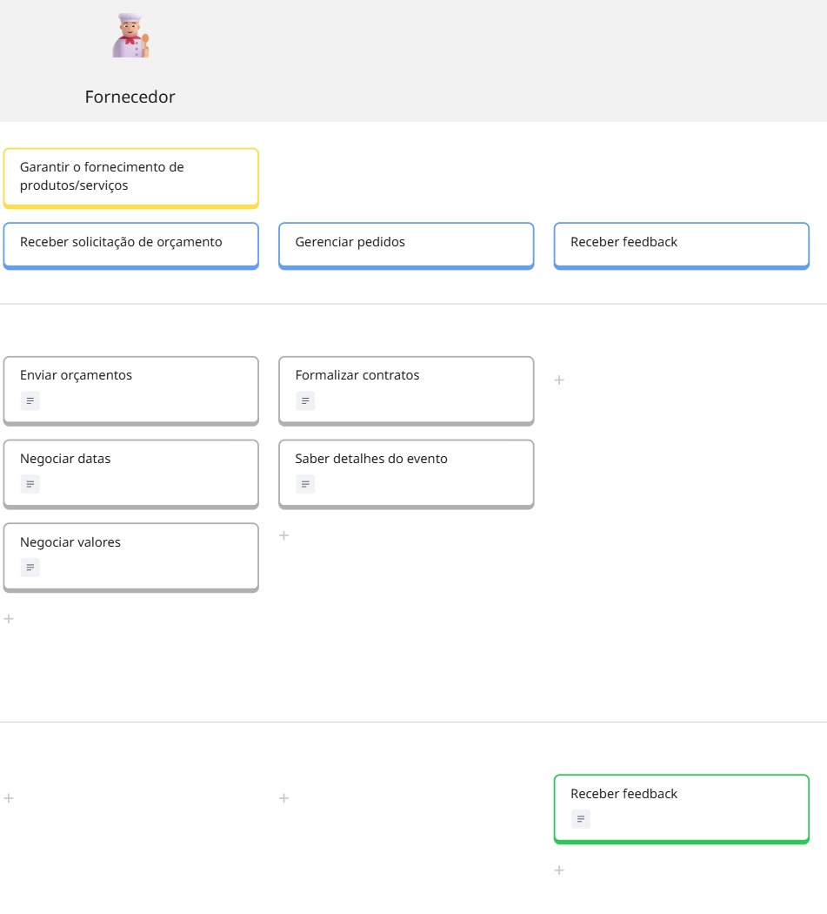
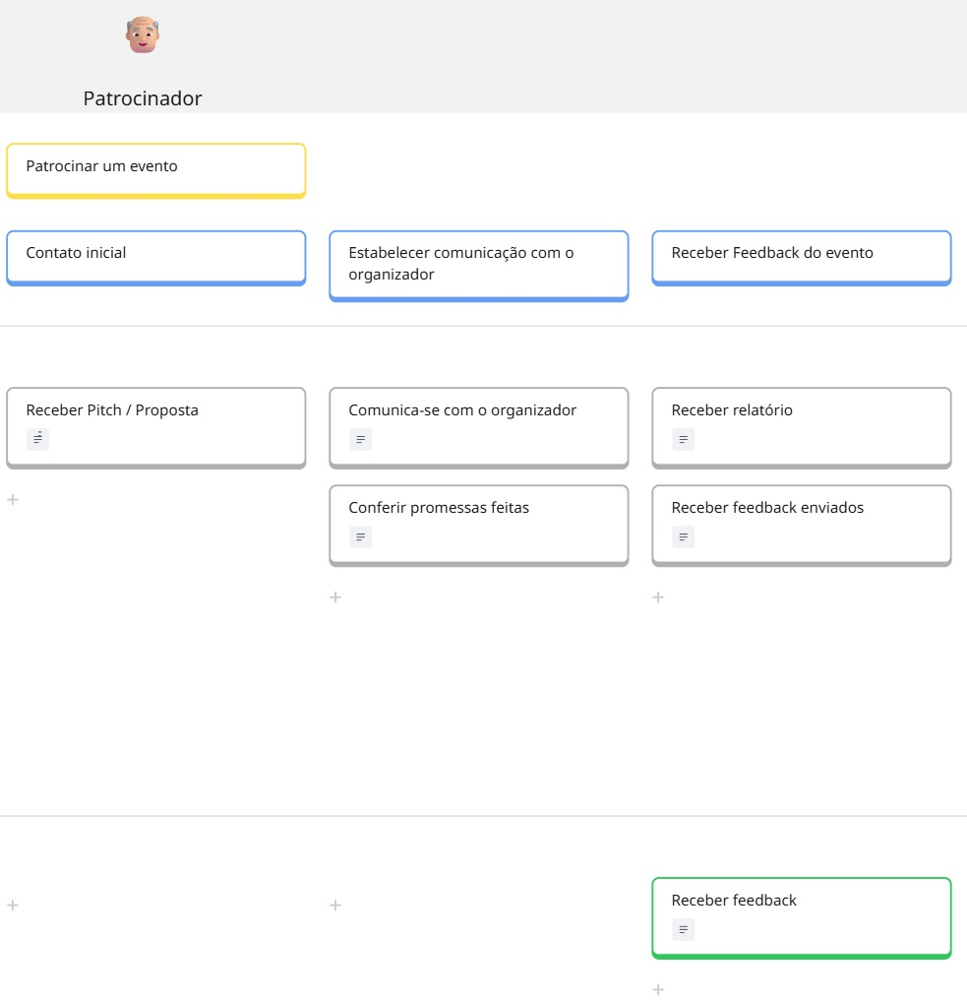
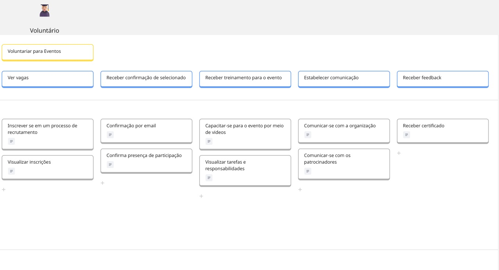

### **1.1 User Story Map**

Um User Story Map é uma ferramenta visual que ajuda equipes a entender e organizar o trabalho de desenvolvimento de software sob a perspectiva do usuário. Imagine-o como um grande painel, geralmente físico (post-its e parede) ou digital, onde as atividades do usuário são mapeadas em uma linha do tempo horizontal, e as funcionalidades do sistema que suportam essas atividades são dispostas verticalmente.

### **1.2 Estudo de caso - ComunEventos**
A ComunEventos é uma startup criada por três jovens empreendedores com o propósito de transformar a organização de eventos comunitários. A ideia é melhorar tanto a forma como esses eventos são organizados quanto a experiência de quem participa, seja como voluntário, patrocinador, fornecedor ou público.

A proposta é simples: reunir em um só lugar todas as ferramentas que facilitam a organização, a comunicação e o envolvimento das pessoas. Além de ajudar na organização, a plataforma também quer aproximar a comunidade, incentivar parcerias com fornecedores e patrocinadores locais e valorizar quem se dedica voluntariamente para fazer os eventos acontecerem.

Outro ponto importante é que a ComunEventos quer ser uma solução acessível, diferente de outras ferramentas no mercado que costumam ser caras e pouco práticas para quem organiza eventos menores ou comunitários.

O objetivo final é facilitar a realização desses encontros, fortalecer a participação da comunidade e criar uma experiência melhor para todos os envolvidos, desde quem ajuda a organizar até quem vai lá só para curtir o evento.

### **1.3 Atividades por personas - ComunEventos**

**Lengenda** 

| Cor             | Significado  |
|------------------|--------------|
| Amarelo | Objetivos    |
| Azul     | Atividades   |
| Cinza    | MVP          |
| Verde   | Release    |

**Organizador do Evento** 

**Participante** 

**Fornecedor** 

**Patrocinador** 

**Voluntário** 

O Usm completo está disponível no link: [USM](https://miro.com/welcomeonboard/Q0RVWkFOUlhaTlFiWDZqK09mUHRKbi9xSnA0bWJqYXBXTEZBYnVqNzRJYTlCL0dRVzdZbWhLVURldFRxRnJ0Uzcva0ZlenpYWmlvcElSUDlkY2ZBSUlrVFF1ZjMySUo0dUhFUkVFTjR5R0JOeHNMaWVtTnZ4YS9NNTVmTWx6VXByVmtkMG5hNDA3dVlncnBvRVB2ZXBnPT0hdjE=?share_link_id=299698948754)

<iframe width="768" height="432" src="https://miro.com/app/live-embed/uXjVIo3DYio=/?embedMode=view_only_without_ui&moveToViewport=-12073,-4943,29910,12501&embedId=669625604583" frameborder="0" scrolling="no" allow="fullscreen; clipboard-read; clipboard-write" allowfullscreen></iframe>

### **1.4 Detalhamento por Backnone - ComunEventos**

### 🎯 BB01 - Gerenciar eventos

---

### Atividade: **Criar Evento**

#### US01 - Cadastrar Evento  
Eu, como **organizador**, quero cadastrar um novo evento inserindo título, local, data e descrição.

#### US02 - Definir Tipo de Evento  
Eu, como **organizador**, quero definir o tipo do evento para organizá-lo corretamente.

---

### Atividade: **Divulgar evento**

#### US03 - Gerar links de divulgação 
Eu, como **organizador**, quero gerar links de divulgação e compartilhá-los nas redes sociais.

#### US04 - Criar materiais
Eu, como **organizador**, quero gerar materiais (cartazes digitais, convites) para a divulgação e compartilhá-los nas redes sociais.

#### US05 - Criar campanhas de email
Eu, como **organizador**, quero criar campanhas de e-mail para atrair participantes.

---

### Atividade: **Gerenciar Inscrições**

#### US06 - Gerar visualizar lista de inscritos
Eu, como **organizador**, quero visualizar a lista de inscritos para ter controle sobre o público.

#### US07 - Receber pagamento de inscrição
Eu, como **organizador**, quero receber o pagamento das inscrições. 

#### US08 - Editar lista de inscritos
Eu, como **organizador**, quero editar a lista de inscritos para ter controle sobre o público.

---

### Atividade: **Gerenciar Fornecimento**

#### US09 - Criar termos e compromissos
Eu, como **organizador**, quero criar termos e compromissos diretamente na plataforma. 

#### US10 - Comunicar com fornecedores
Eu, como **organizador**, quero manter comunicação com fornecedores.

#### US11 - Visualizar datas e detalhes do evento
Eu, como **organizador**, quero ser lembrado das datas e detalhes da entrega.

#### US12 - Visualizar termos e compromissos acordados
Eu, como **organizador**, quero visualizar compromissos e termos acordados.

#### US13 - Enviar propostas
Eu, como **organizador**, quero enviar propostas a patrocionadores diretanebte pela plataforma. 

---

### 🎯 BB02 - Gerenciar Voluntários

---

### Atividade: **Coordenar Voluntários e Fornecedores**

#### US14 - Recrutar voluntários  
Eu, como **organizador**, quero recrutar e gerenciar voluntários diretamente na plataforma. 

#### US15 - Comunicar com voluntários
Eu, como **organizador**, quero manter comunicação com os voluntários selecionados.

#### US16 - Atribuir tarefas para voluntarios
Eu, como **organizador**, quero atribuir tarefas a voluntários.

#### US17 - Gerar certificados de participação
Eu, como **organizador**, quero gerar certificados de participação para os voluntários. 

---

### Atividade: **Realizar Evento**

#### US18 - Notificar participantes
Eu, como **organizador**, quero notificar os participantes sobre qualquer mudança que ocorrer durante o evento. 

---

### Atividade: **Coletar Feedback do Evento**

#### US19 - Enviar formulario de avaliação
Eu, como **organizador**, quero enviar formulários de avaliação para medir o sucesso do evento após a sua realização. 

---

### 🎯 BB03 - Participar de Eventos

---

### Atividade: **Buscar Evento**

#### US20 - Filtrar por tipo  
Eu, como **participante**, quero navegar na plataforma por eventos por "tipo".

#### US21 - Filtrar por categoria
Eu, como **participante**, quero navegar na plataforma por eventos por "categoria".

#### US22 - Filtrar eventos por data 
Eu, como **participante**, quero navegar na plataforma por eventos por "data".

#### US23 - Filtrar por local 
Eu, como **participante**, quero navegar na plataforma por eventos por "local".

#### US24 - Recomendar eventos personalizados 
Eu, como **participante**, quero ver eventos recomendados com base no meu perfil.

---

### Atividade: **Inscreve-se em um evento**

#### US25 - Preencher formulario de inscrição
Eu, como **participante**, quero me inscrever em eventos  facilmente em poucos cliques ( 3/5 cliques ).
 
#### US26 - Efetuar pagamento
Eu, como **participante**, quero pagar meu ingresso na própria plataforma na qual me inscrevi para o evento.

#### US27 - Notificar a confirmação de inscrição 
Eu, como **participante**, quero ser notificado sobre a confirmação da minha inscrição no evento.

#### US28 - Receber confirmação de pagamento
Eu, como **participante**, quero receber um comprovante de pagamento realizado via email para a confirmação do meu pagamento. 

---

### Atividade: **Notificações**

#### US29 - Receber avisos
Eu, como **participante**, desejo receber avisos de mudanças sobre data, local e dia do evento no qual vou participar. 
 
#### US30 - Receber informações do evento
Eu, como **participante**, quero receber informações do evento, como um mapa e a programação do dia via email.  

#### US31 - Criar evento no calendário
Eu, como **participante**, quero que após a confirmação de inscrição, ou de pagamento quando necessário, que o evento seja adicionado automaticamente a minha agenda correspondente ao email que foi enviado para a inscrição. 

#### US32 - Receber divulgações
Eu, como **participante**, quero receber divulgações de patrocinadores. 

---

### Atividade: **Dar feedback sobre o evento**

#### US33 - Avaliar evento
Eu, como **participante**, quero avaliar o evento após a minha participação.

---

### 🎯 BB04 - Garantir o fornecimento de produtos/serviços

---

### Atividade: **Receber solicitações de orçamento**

#### US34 - Enviar orçamentos 
Eu, como **fornecedor**, quero receber convites de eventos e enviar orçamentos.

#### US35 - Negociar datas
Eu, como **fornecedor**, quero negociar datas diretamente com os organizadores.

#### US36 - Negociar valores
Eu, como **fornecedor**, quero negociar valores diretamente com os organizadores.

---

### Atividade: **Gerenciar Pedidos**

#### US37 - Formalizar contratos 
Eu, como **fornecedor**, quero formalizar os contratos com os organizadores de evento com datas, valores e produtos definidos para o fornecimento no dia do evento. 

#### US38 - Saber detalhes do evento
Eu, como **fornecedor**, quero ter contato direto com o organizador para saber detalhes do evento  e acesso exclusivo ao evento. 

---

### Atividade: **Receber feedback**

#### US39 - Receber feedback
Eu, como **fornecedor**, desejo receber um feedback sobre o evento.

---

### 🎯 BB05 - Patrocinar um evento

---

### Atividade: **Contato inicial**

#### US40 - Receber Pitch / Proposta
Eu, como **patrocinador**, quero receber um Pitch ou uma apresentação me informando sobre detalhes e benefícios de patrocinar o evento. 

---

### Atividade: **Estabelecer comunicação com o organizador**

#### US41 - Comunica-se com o organizador
Eu, como **patrocinador**, quero ter uma comunicação direta com o organizador.

####  US42 - Receber Pitch / Proposta
Eu, como **patrocinador**, quero me certificar que os meus logotipos e estante esteja no evento de maneira correta.

---

### Atividade: **Receber feedback do evento**

#### US43 - Receber relatório
Eu, como **patrocinador**, quero receber relatórios sobre o alcance do patrocínio no evento. 

#### US44 - Receber feedback enviados
Eu, como **patrocinador**, quero receber os feeedbacks enviados após o evento dos participantes do evento. 

#### US45 - Receber feedback 
Eu, como **patrocinador**, desejo receber um feedback sobre o evento.

---

### 🎯 BB06 - Voluntariar para eventos

---

### Atividade: **Ver vagas**

####  US46 - Inscrever se em um processo de recrutamento
Eu, como **voluntário**, quero me inscrever em um processo de recrutamento para eventos de maneira dinâmica. 
####  US47 - Visualizar inscrições
Eu, como **voluntário**, desejo visualizar as inscrições na qual realizei para participar de processos de seleções para voluntariado em eventos. 
 
---

### Atividade: **Receber confirmações de selecionado**

####  US48 - Confirmação por email
Eu, como **voluntário**, desejo receber uma confirmação via email da minha seleção para o voluntariado para qual me inscrevi e fui selecionada.  
 
####  US49 - Confirma presença de participação
Eu, como **voluntário**, desejo confirmar a minha participação de voluntariado para o evento através de um formulário de confirmação. 
 
---

### Atividade: **Receber treinamento para o evento**

#### US50 - Capacitar-se para o evento por meio de videos
Eu, como **voluntário**, quero me capacitar para o voluntariado do  por meio de vídeos educacionais. 
 
#### US51 - Visualizar tarefas e responsabilidades
Eu, como **voluntário**, quero visualizar as minhas tarefas e responsabilidades durante o evento que estou participando/trabalhando. 
 
---

### Atividade: **Estabelecer comuniação**

#### US52 - Comunicar-se com a organização
Eu, como **voluntário**, desejo ter uma comunicação clara e direta com a organização do evento.  
 
#### US53 - Comunicar-se com os patrocinadores
Eu, como **voluntário**, desejo ter um canal de comunicação com os patrocinadores para auxilia-los durante o evento. 
 
---

### Atividade: **Receber feedback**

#### US54 - Receber certificado
Eu, como **voluntário**, desejo receber um certificado comprovando as horas de serviços voluntário. 
 
---

