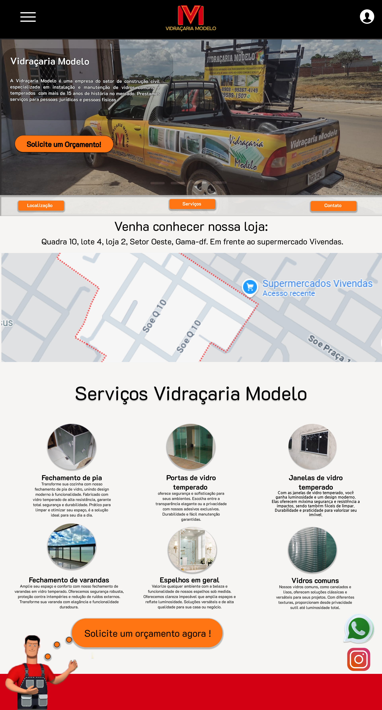
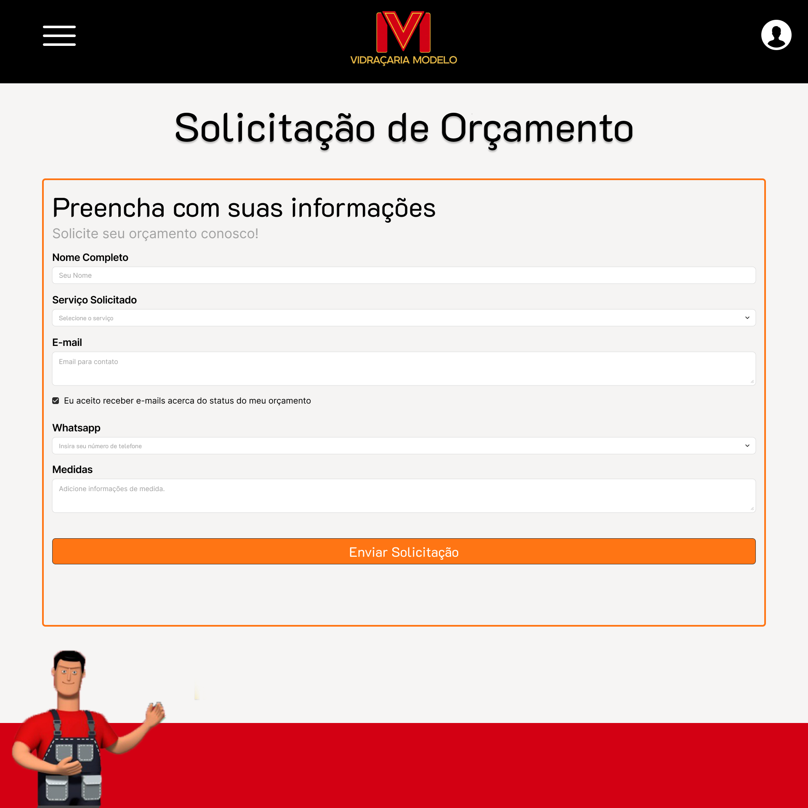
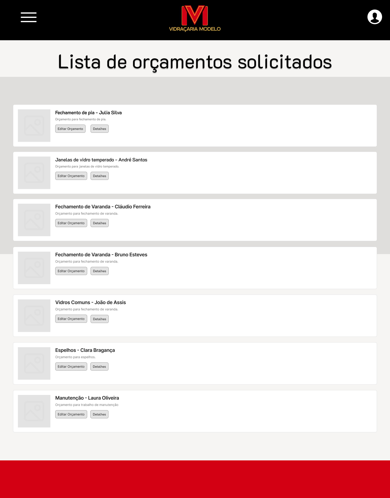
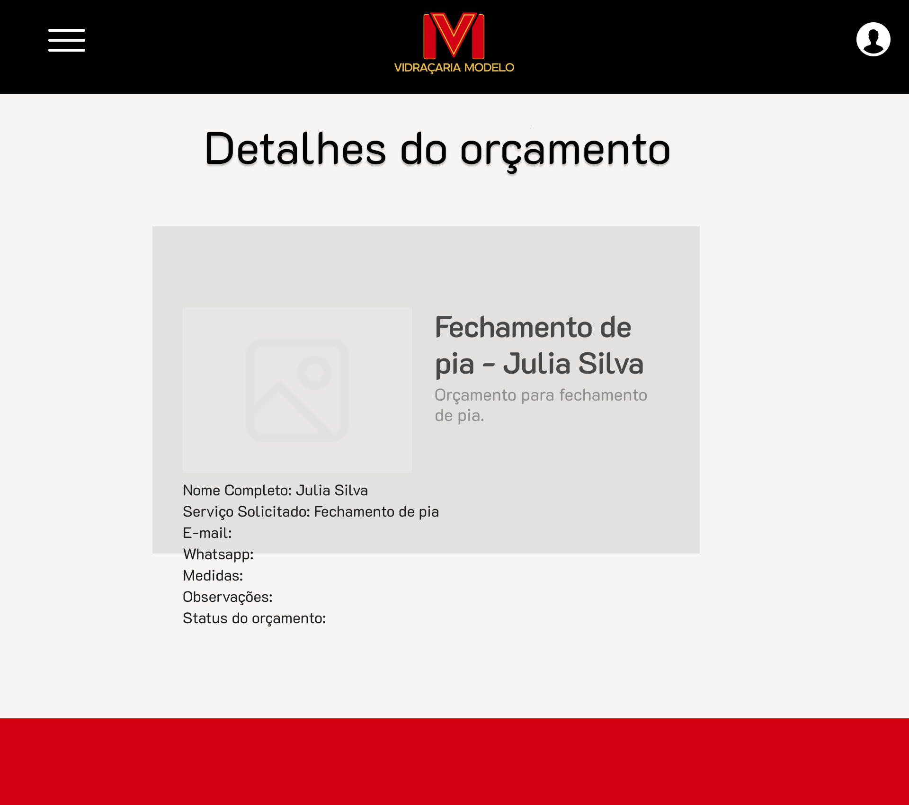
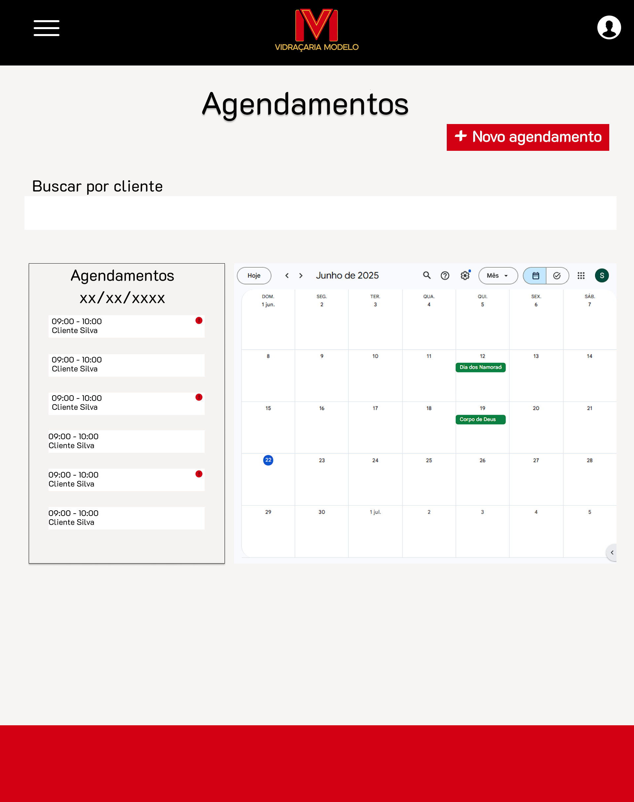
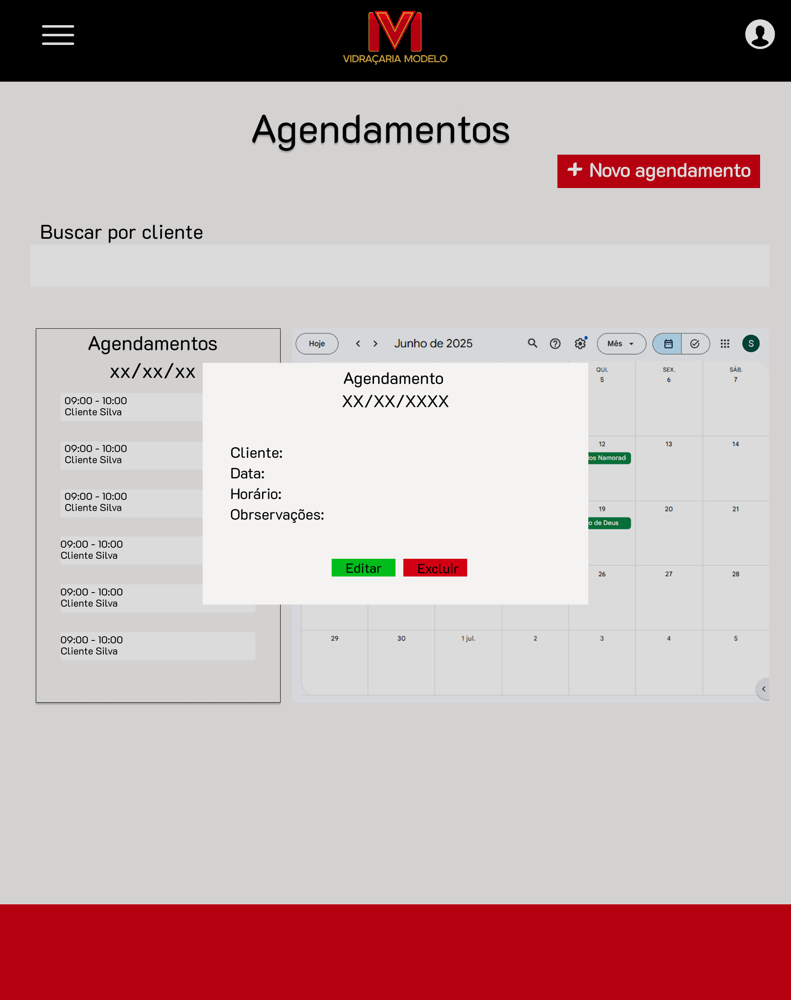
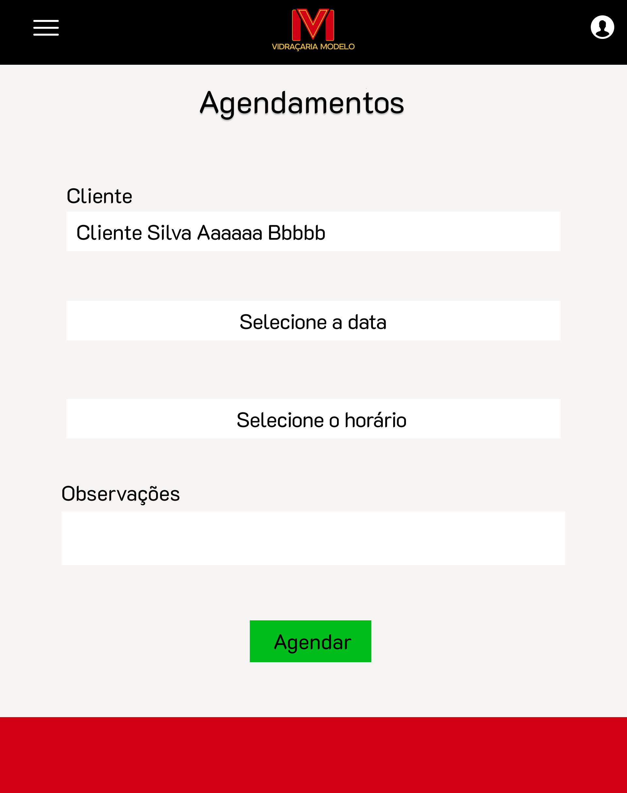

# Protótipos Desenvolvidos

Durante os ciclos do processo RAD, a equipe utilizou a prototipação utilizando a ferramenta Figma para criar os protótipos de alta fidelidade. Esses protótipos são realizados após uma conversa com os stakeholders.

## Telas Desenvolvidas

Abaixo estão algumas das telas desenvolvidas até o momento:

---

🔗 **Acesse os protótipos de alta fidelidade no Figma:**

[Protótipos no Figma](https://www.figma.com/design/reBg5nLQBs1u2xvyafPvku/Vidra%C3%A7aria_modelo?node-id=23-7&p=f&t=xFDGaivhsfXPTbTd-0)
