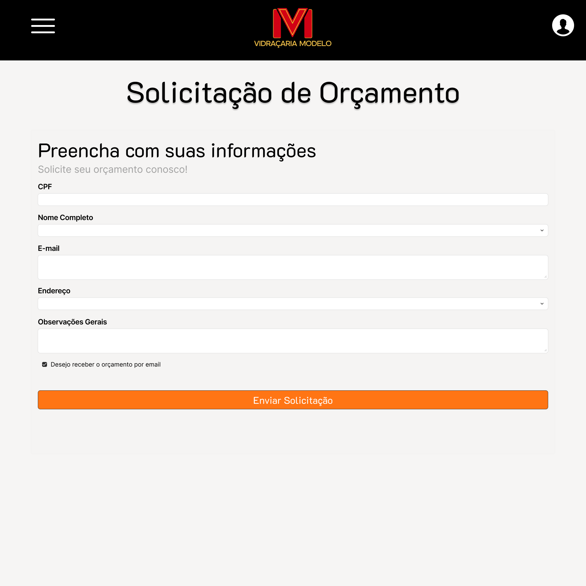
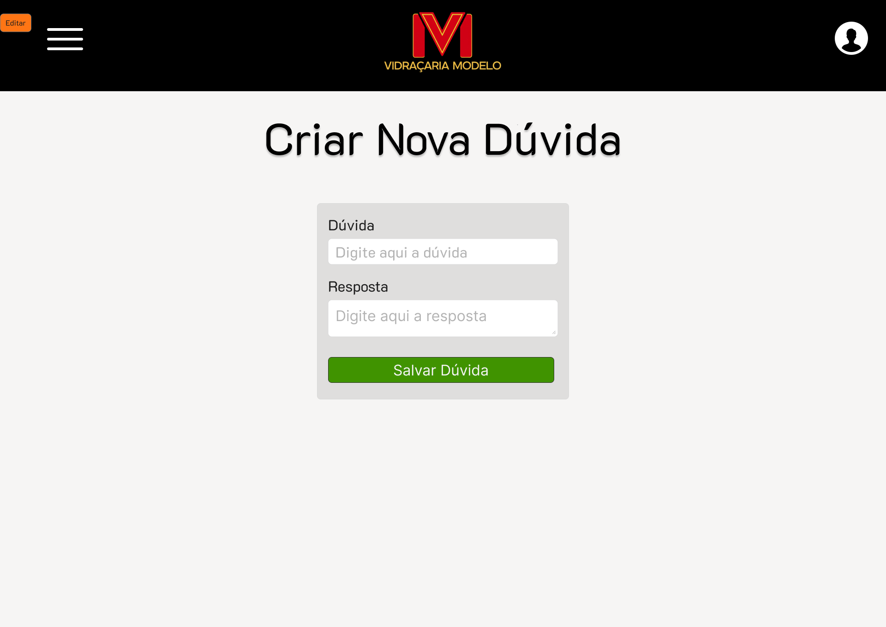

# Protótipos Desenvolvidos

Durante os ciclos do processo RAD, a equipe utilizou a prototipação utilizando a ferramenta Figma para criar os protótipos de alta fidelidade. Esses protótipos são realizados após uma conversa com os stakeholders.

## Telas Desenvolvidas

Abaixo estão algumas das telas prototipadas separadas por seus ciclos:

### 📌 Ciclo 1

### 📌 Ciclo 2

### 📌  Ciclo 3

### 📌  Ciclo 4 

# Diagrama entidade-Relacionamento

Durante os ciclos o diagrama entidade relacionamento teve mudanças e se estabelece a versão final:

---

🔗 **Acesse os protótipos de alta fidelidade no Figma:**

[Protótipos no Figma](https://www.figma.com/proto/reBg5nLQBs1u2xvyafPvku/Vidra%C3%A7aria_modelo?node-id=520-570&t=GoIGJh2PbjXE0PNC-1)
