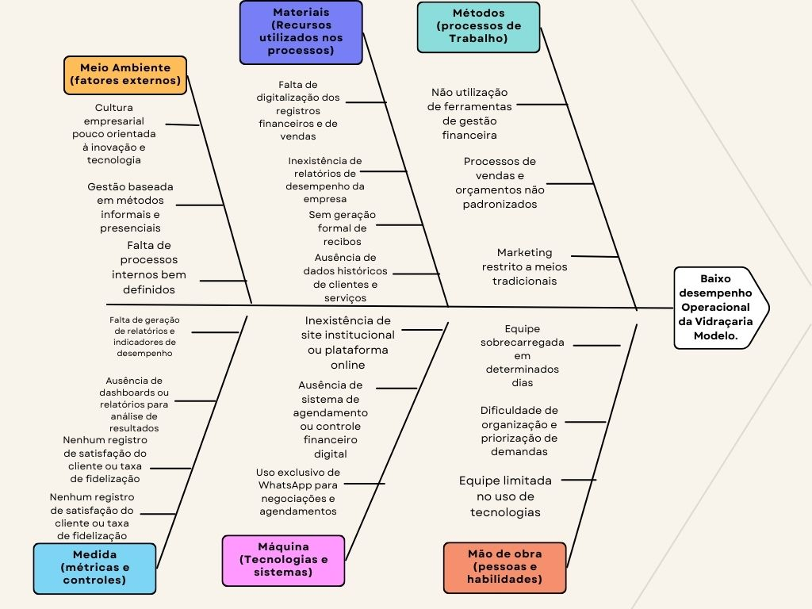

## 1.1 Introdução ao Negócio e Contexto

A Vidraçaria Modelo é uma empresa do setor de construção civil fundada em 2020,
especializada em serviços de instalação e manutenção de vidros comuns, temperados e
espelhos. Opera em uma loja física localizada no Gama-DF e tem sua área de atuação
principal na cidade do Gama e regiões mais próximas, mas não se limita e pode atuar em
todas as Regiões Administrativas do DF. Seu objetivo é entregar o máximo de valor ao
cliente através do desenvolvimento de soluções inovadoras em vidros comuns e
temperados. Têm o cliente final como seu principal público alvo, realizando serviços em
residências, escritórios e demais localidades. Também atende empresas de pequeno e médio
porte, porém com menor frequência.

Seu posicionamento online é muito reduzido, contando apenas com uma conta no instagram
e uma página de anúncios feita pela plataforma do Google e não utiliza ferramentas digitais
para organização interna da empresa.

---

## 1.2 Identificação da Oportunidade ou Problema

O principal problema identificado na Vidraçaria Modelo é o baixo desempenho operacional do empreendimento, observado em diversas fases do negócio, especialmente na falta de posicionamento online, o que implica na dependência exclusiva de meios tradicionais de marketing e negociação, retardando o possível crescimento da empresa. Esse desempenho comprometido também se manifesta na forma como são gerenciados os orçamentos e a comunicação interna, atualmente realizados via WhatsApp ou presencialmente. Essa limitação operacional acaba resultando em orçamentos marcados que não são atendidos, dificuldades no repasse de demandas para a equipe e uma sobrecarga de trabalho concentrada em determinados dias, devido à ausência de um sistema eficiente de gerenciamento de dados. No que tange à falta de sistematização a organização sofre com a inexistência de uma estrutura organizada para a gestão financeira e de vendas: não há registros digitalizados de despesas, tampouco emissão formal de recibos pelos serviços prestados, o que compromete o controle financeiro e a análise do desempenho da empresa ao longo do tempo. O relacionamento com os clientes também sofre com a falta de sistematização, dificultando o acompanhamento de atendimentos anteriores, a identificação de preferências e a implementação de estratégias de fidelização. Esses fatores, todos derivados do baixo desempenho operacional, revelam não apenas os obstáculos enfrentados atualmente, mas também oportunidades estratégicas que podem ser exploradas por meio da adoção de ferramentas digitais especialmente em um setor onde o posicionamento online ainda é pouco explorado.

Segue a Figura com o diagrama de Ishikawa utilizando a organização pelos 6Ms para representar as causas e o problema da Vidraçaria modelo:

---

## 1.3 Desafios do Projeto

O principal desafio técnico do projeto é a implementação de um site que facilite o contato do
possível cliente com a empresa através da internet, além de permitir que um orçamento seja
marcado e gerenciado pela empresa com a possibilidade de que se o cliente estiver com os
dados necessários para a realização do cálculo, consiga fazer o orçamento automaticamente,
permitindo o ajuste de demanda e o aceleramento dos processos no dia de trabalho.
Outro desafio é a diferença de conhecimento relativo à tecnologia adotada dentro da equipe de
desenvolvimento, visto que alguns membros do time tem mais experiência com determinadas
tecnologias e processos, fazendo-se necessárias estratégias de nivelamento de conhecimento.

---

## 1.4 Segmentação de Clientes

A Vidraçaria Modelo atende principalmente 3 segmentos:

#### 1. Reformadores residenciais (Pessoa física)

- **Perfil:** Proprietários de imóveis (casa ou apartamento) em reforma ou construção.  
- **Idade:** 28–60 anos  
- **Objetivos:** Modernizar ambientes, aumentar segurança, valorizar o imóvel.  
- **Produtos de interesse:**
  - Box de banheiro
  - Espelhos sob medida
  - Janelas e portas de vidro temperado
  - Sacadas envidraçadas
  - Tampos de mesa em vidro

#### 2. Pequenas e médias empresas (B2B leve)

- **Perfil:** Proprietários de comércios locais, escritórios, clínicas, academias.  
- **Objetivos:** Montar ou reformar ponto comercial com estética moderna e praticidade.  
- **Produtos de interesse:**
  - Fachadas em vidro
  - Divisórias internas
  - Portas automáticas ou pivotantes
  - Balcões em vidro
  - Espelhos decorativos

#### 3. Profissionais de obra (Influenciadores da compra)

- **Perfil:** Pedreiros, gesseiros, mestres de obras, pequenos empreiteiros.  
- **Objetivos:** Indicar fornecedores de confiança para seus clientes finais.  
- **Produtos de interesse:** Todos, mas principalmente os de uso padrão e fácil instalação.

